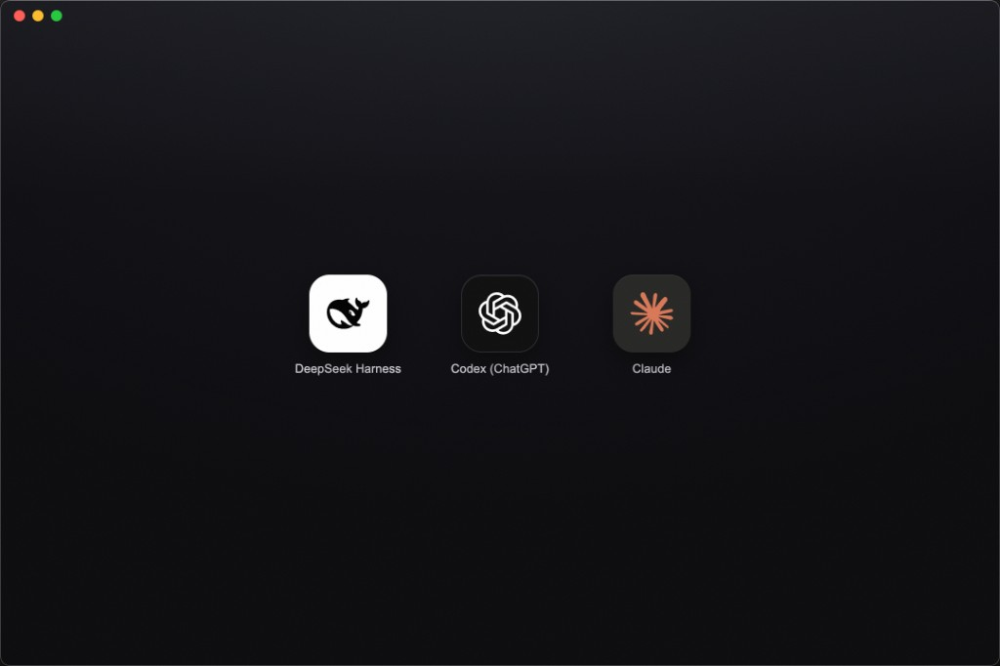
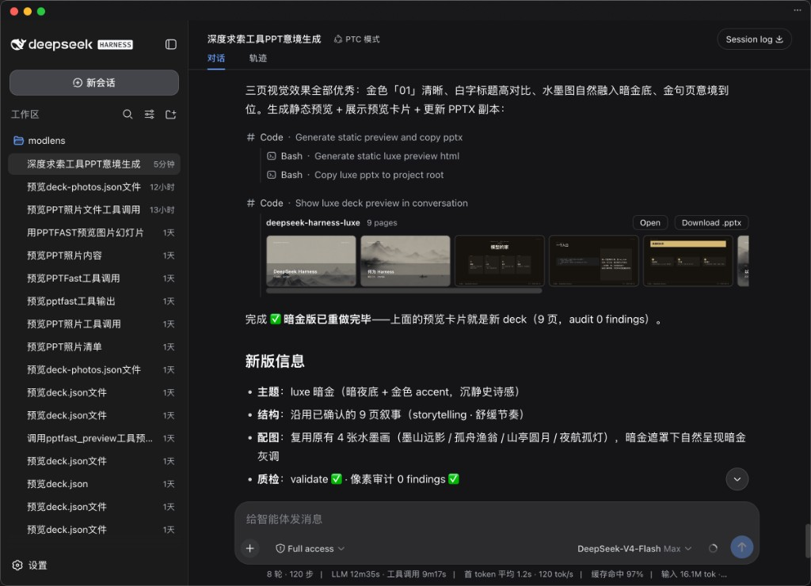

<p align="center">
  
</p>

<h1 align="center">AIManager</h1>

<p align="center"><b>Install and launch DeepSeek Harness in one click.</b></p>

<p align="center">🥇 <b>The most foolproof DeepSeek Harness launcher</b> 🥇</p>

<p align="center">
  <a href="./README.zh-CN.md">简体中文</a> ·
  <a href="CHANGELOG.md">Changelog</a> ·
  <a href="CONTRIBUTING.md">Contributing</a> ·
  <a href="https://github.com/liustack/modlens"><b>👁️ ModLens (vision)</b></a> ·
  <a href="https://github.com/liustack/modsearch"><b>🔎 ModSearch (web search)</b></a>
</p>

<p align="center">
  <a href="https://x.com/liustack"></a>
  <a href="LICENSE"></a>
  
  
  
</p>

DeepSeek Harness (dsh) has no desktop app of its own and installs through a terminal. AIManager gives it one. **Click the whale, and dsh is installed, running, and ready to chat** — no terminal, no commands, no setup. Claude Desktop and the Codex (ChatGPT) app launch from the same screen.

## Screenshots

The launchpad — one click on any icon:



DeepSeek Harness running inside AIManager:



## Talk to us

Issues are welcome any time: [open one](https://github.com/liustack/aimanager/issues/new), in English or Chinese. And come find me on X: **[@liustack](https://x.com/liustack)** — which harness should get one-click support next, what broke, what should come next. New releases land there first.

## Highlights

- **Installed and chatting in one click.** The whale icon covers everything: a private Node.js runtime, dsh itself, startup, and the chat UI opening right inside the app. Zero terminal, zero commands.
- **Official apps, direct.** Claude Desktop and the Codex (ChatGPT) app launch if installed, and install in one click if not — App Store-style progress ring included.
- **Fully compatible with a hand install.** The hosted dsh reuses the official state directory, so every tutorial on the internet still applies, and a copy you installed yourself keeps working untouched.
- **Free forever.** MIT. No paid tier, no "pro" features, no ads.

## Install

Download from [Releases](https://github.com/liustack/aimanager/releases): `.dmg` for Mac, `.exe` for Windows.

Mac builds are Developer ID signed and notarized by Apple — download, drag to Applications, double-click, done.

On Windows, if a blue SmartScreen prompt appears, click "More info" → "Run anyway".

v0.1 is verified end to end on macOS; Windows real-machine verification is next in line.

Developers can run from source:

```bash
pnpm install
pnpm dev
```

## Contributing

AIManager does not accept pull requests. The project is maintained by a single author who reviews every line, which is a deliberate choice for reliability. Two effective ways to contribute:

- **[Open an issue](https://github.com/liustack/aimanager/issues).** Bugs, suggestions, confusing errors, unclear docs. Issues are read and shape what gets built next.
- **Fork it.** Under MIT your copy is fully yours to modify and publish.

Details, including how the code is organized, in [CONTRIBUTING.md](CONTRIBUTING.md).

## Shameless plug

This project runs on LIUSTACK Skills: `shaping` before you build, `coding` while you build, `dig` when it breaks, `snapshot` when you hand off. Lighter than Superpowers, and stronger.

```bash
npx -y skills add liustack/vibemaster -g
```

⭐ If it helps, star [AIManager](https://github.com/liustack/aimanager) and [VibeMaster](https://github.com/liustack/vibemaster). Stars are how the next developer finds them.

## Key ecosystem partners

The projects worth recommending in the DeepSeek Harness ecosystem.

- 👁️ **[ModLens](https://github.com/liustack/modlens)** — Plug-in vision for the text-only DeepSeek and GLM models: paste an image straight into the chat and it reads it.
  为纯文本 DeepSeek / GLM 模型补上视觉能力的外挂插件,图片直接粘贴进对话就能读。
- 🔎 **[ModSearch](https://github.com/liustack/modsearch)** — Plug-in web search, X search, and page fetch for models without native web access.
  为没有联网能力的模型补上网页搜索、X 搜索和页面抓取。

## Star History

<a href="https://www.star-history.com/?repos=liustack%2Faimanager&type=date&legend=top-left">
 <picture>
   <source media="(prefers-color-scheme: dark)" srcset="https://api.star-history.com/chart?repos=liustack/aimanager&type=date&theme=dark&legend=top-left&sealed_token=J8Ty12u3tzeBqJYzwA1DXO8ggEERZWc42zz9Nlr1ZjWrKzZnyaELmthABUwMc4LKHcqZ1Lq76LX-elmCQgUf2IAhlo2DkhKD_qhb5_yBAc_yWMi6D_mp0g" />
   <source media="(prefers-color-scheme: light)" srcset="https://api.star-history.com/chart?repos=liustack/aimanager&type=date&legend=top-left&sealed_token=J8Ty12u3tzeBqJYzwA1DXO8ggEERZWc42zz9Nlr1ZjWrKzZnyaELmthABUwMc4LKHcqZ1Lq76LX-elmCQgUf2IAhlo2DkhKD_qhb5_yBAc_yWMi6D_mp0g" />
   
 </picture>
</a>

## Disclaimer

Provided as-is under the MIT License below. The author makes no warranty and gives no endorsement for any particular use. The AI apps and runtimes that AIManager installs (DeepSeek Harness, Node.js, Claude Desktop, the Codex app, and others) belong to their vendors and are governed by their own terms, which you are responsible for.

## License

MIT
